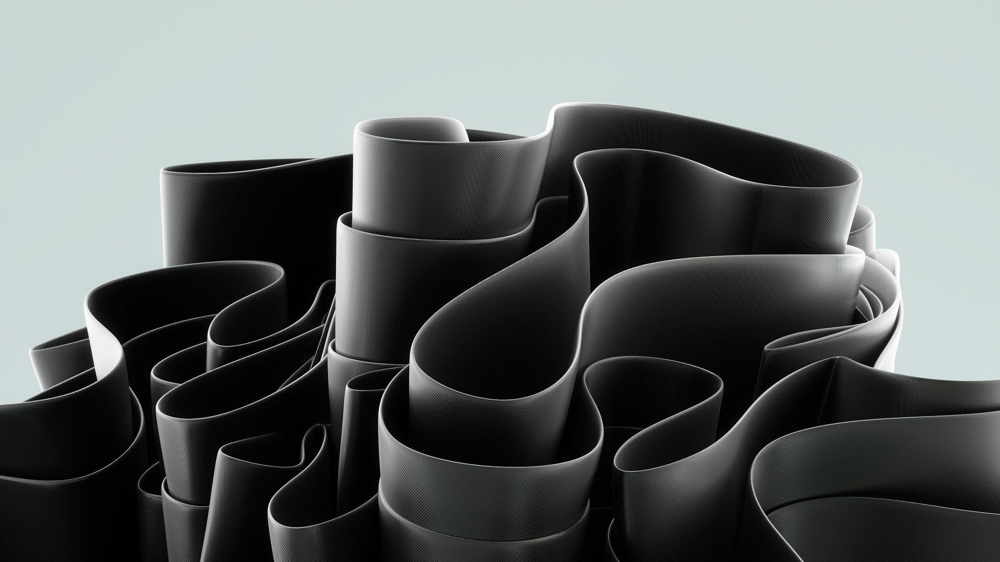

# 🔥 FlameWeb — The Minimal Web IDE  

🚀 **FlameWeb** is a lightweight, modern, and visually stunning **browser-based IDE** built to make coding simple, fast, and inspiring.  
This project currently focuses on the **landing page** — a futuristic glassmorphic interface that introduces FlameWeb’s vision for the next generation of web development tools.

---

## 📌 Project Overview  

**FlameWeb** is a company-driven project to design and build a **next-generation web IDE** from scratch.  
It combines **aesthetics**, **performance**, and **developer comfort** into one environment that feels seamless to use — whether you’re writing a quick HTML page or building full web apps.

The current phase focuses on a **landing page** that visually represents what FlameWeb stands for:  
> “Power. Clarity. Simplicity — in one flame.”

---

## ✨ Features (Planned / In Progress)  

- ✅ Responsive glassmorphism landing page  
- ✅ Animated navigation menu (hamburger toggle)  
- ⏳ Glowing edge effects and motion blur  
- ⏳ Scattered icon/image showcase (for tools & features)  
- ⏳ Interactive IDE mockup section (HTML, CSS, JS editor preview)  
- ⏳ Firebase or Flask integration for code saving  
- ⏳ Theme customization (Dark / Light / Flame Mode 🔥)  

---

## 🗂️ Project Structure  

flameweb/
│── index.html # Landing page
│── style.css # Styling (glassmorphism, glow, layout)
│── script.js # JS for animations and interactivity
│── images/ # Banner, backgrounds, or screenshots
│ └── banner.png
│── README.md # Project documentation

yaml
Copy code

---

## 🛠️ Tech Stack  

- **HTML5**  
- **CSS3** (Glassmorphism, Neon Glow, Animations)  
- **Vanilla JavaScript**  
- *(Later)* **Firebase / Flask** for backend storage  

---

## 🚀 Getting Started  

To clone the private repository:  
```bash
git clone git@github.com:Hidden-Umah/flameWeb.git
cd flameWeb
⚠️ Note: This is a private, company-managed project.
Access is restricted to authorized team members only.

🎨 Design Goals
Elegant glassmorphic interface with soft blurs and light refractions

Subtle neon glow around key elements

Smooth animations for scroll and hover states

“Scattered layout” aesthetic — abstract, creative, and tech-inspired

Fully responsive for all screen sizes

📅 Roadmap
Phase	Focus	Progress
1	Base layout & glassmorphism	✅ Done
2	Navigation & animation logic	✅ Done
3	Icon animations + glow effects	⏳ In Progress
4	IDE mockup + interactivity	🔜 Planned
5	Backend & snippet saving	🔜 Planned

🏢 Project Ownership
FlameWeb is a proprietary project under the Legend AI Lab organization.
All rights reserved © 2025 Legend AI Lab.

⚖️ License
This project is protected under a Company Proprietary License.

🔒 Usage Restrictions:

You may not copy, modify, or redistribute this code or its components.

Source code access is restricted to authorized team members.

External forks and pull requests are not permitted without company approval.

For licensing inquiries or collaboration requests, please contact:
📧 legendailab@outlook.com

yaml
Copy code

---


